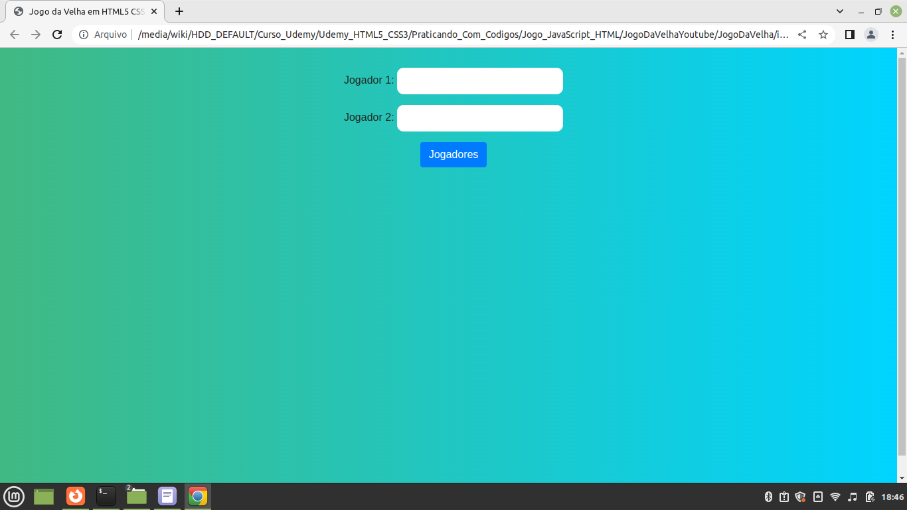
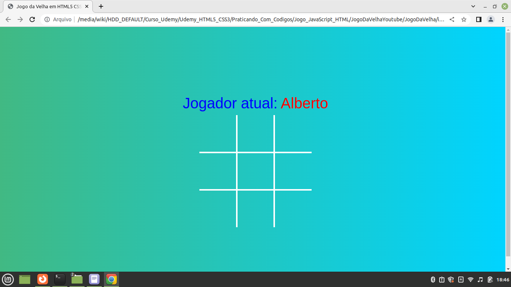
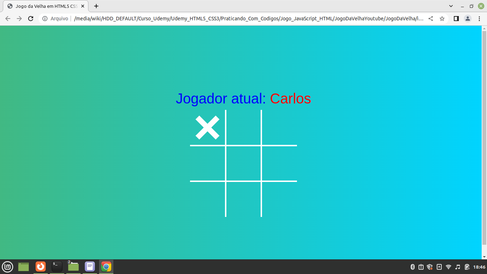
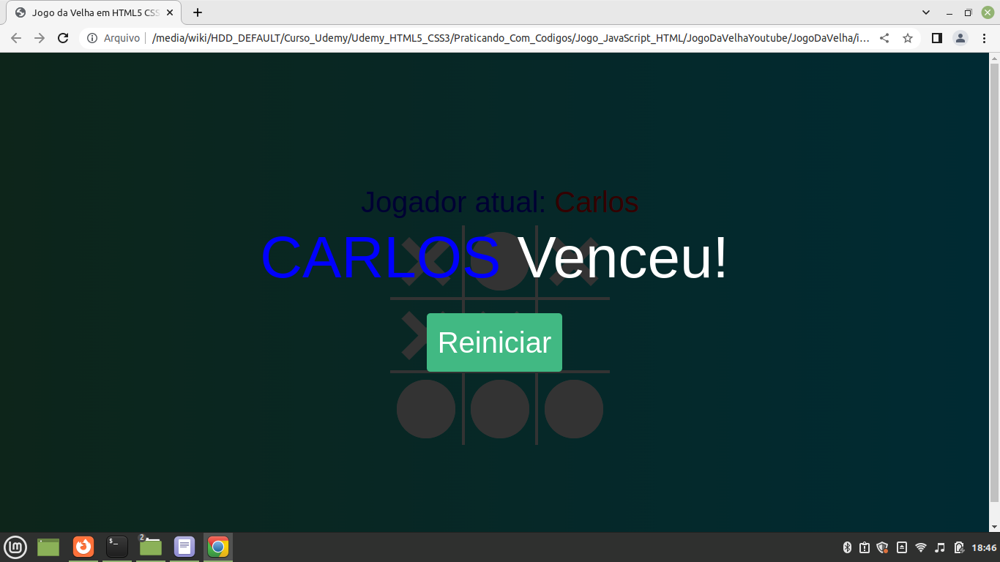

- [AULA YOUTUBE](https://youtu.be/0EiX9c4vzRs)

- [REPOSITORIO AULA](https://github.com/felipemotarocha/jogo-da-velha-dicasparadevs)

- [REFERENCIA DAS MELHORIAS](https://gist.github.com/rpkraemer/1152320)

## README JogoDaVelhaYoutube

#### Form para pegar o nome dos jogadores.

------------------
#### Mostra jogador da rodada após definir os jogadores começando pelo X.

------------------
#### Alterna o jogador da rodada que será a O.

------------------
#### Mostra o vencedor da rodada.

